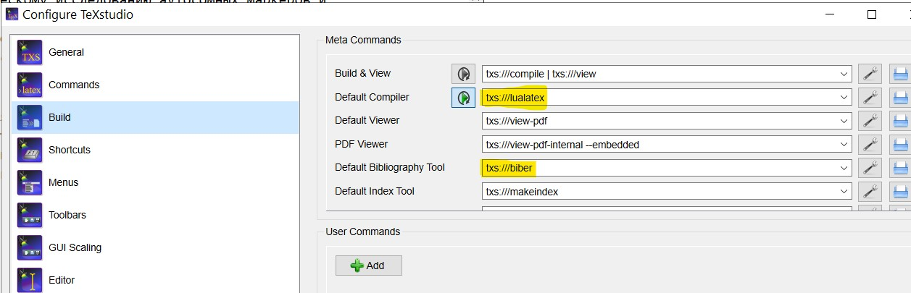

# Шаблон теха для диплома

Сделал шаблон теха для диплома, основываясь на [техе диплома Романа Санду](https://github.com/Mrkol/thesis_vgi/tree/master/text). Я немного добавил стилей для большего соответствия ГОС, и добавил генерацию сразу в формате `PDF/A-1b`, чтобы файл можно было загрузить в антиплагиат.

Пример выхода смотреть в файле [diploma.pdf](./diploma.pdf)

## Overleaf
Для Overleaf надо в настройках поставить, что компилятор `lualatex`

[Этот шаблон на Overleaf](https://www.overleaf.com/read/ygmmnchywmgw)

## Локальный вариант

Проверен с помощью [TexStudio](https://www.texstudio.org/) и [MiKTeX](https://miktex.org/) на Windows 10 (на Mac OS тоже по идеи должно работать, и на Linux наверное тоже, так как эти программы кросс платформенные).

После установки надо в настройках TexStudio поменять Default Compiler на `lualatex` и Default Bibliography Tool на `biber`.

## Если будут проблемы с PDF/A-1b

Есть [такой сайт](https://avepdf.com/pdfa-validation), который выдаёт отчёт о проверки на совместимость форматом, насчёт того как он сохраняет приватность не знаю, так что используйте на свой риск.
